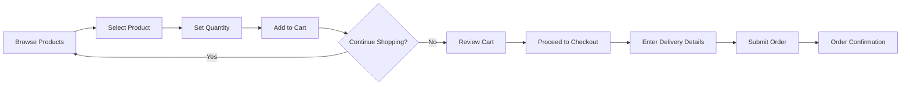
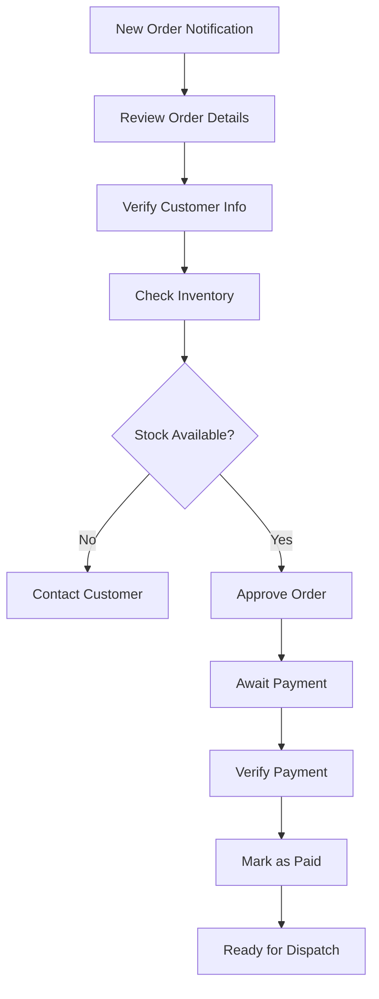
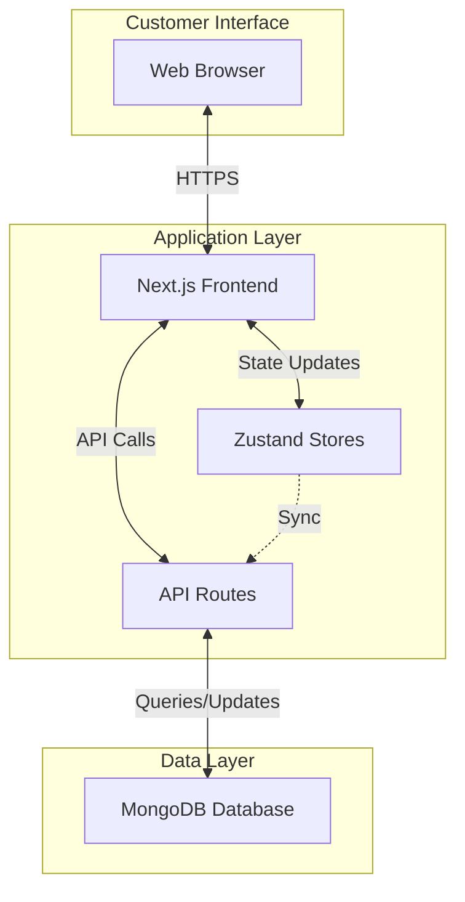

# Business Documentation - M-Commerce Platform

**Document Version:** 1.0  
**Last Updated:** December 6, 2025  
**Platform Type:** Construction Materials E-Commerce & Operations Management System

---

## Executive Summary

This platform is a **full-stack digital commerce solution** for the construction materials industry, specifically focused on cement and building materials distribution. The system serves dual purposes:

1. **Customer-Facing E-Commerce** - Enabling contractors, builders, and construction companies to browse, order, and track cement products
2. **Internal Operations Management** - Providing staff with tools to manage orders, deliveries, payments, and logistics

### Business Value Proposition

- **24/7 Order Processing** - Customers can place orders anytime, reducing phone-based order processing
- **Real-Time Inventory Visibility** - Live inventory status reduces order fulfillment errors
- **Automated Workflow Management** - Order-to-delivery pipeline with status tracking
- **Data-Driven Insights** - Analytics dashboard for revenue tracking and business intelligence
- **Multi-Role Access Control** - 8 distinct staff roles with appropriate permissions

---

## Business Model

### Target Market
- **Primary:** Construction contractors and builders
- **Secondary:** Individual homeowners undertaking construction projects
- **Geographic Focus:** Local/regional cement distribution

### Revenue Streams
1. Direct product sales (cement bags)
2. Bulk order fulfillment
3. Delivery services

### Product Catalog
The platform currently offers **4 primary cement products**:

| Product | Price (₦) | Target Use Case |
|---------|-----------|-----------------|
| **Dangote 3X** | 5,800 | General building needs |
| **BUA Cement** | 5,700 | Versatile construction |
| **Mangal** | 950 | Specialty applications |
| **Blockmaster** | 630 | Industrial-grade construction |

*Additional products available in extended catalog (OPC 43/53 Grade, PPC, White Cement, Rapid Hardening)*

---

## Core Features & Functionality

### 1. Customer-Facing Features

#### 🛍️ Product Catalog & Shopping
- **Product Browsing** - Visual product cards with images, pricing, and descriptions
- **Live Inventory Status** - Real-time stock availability indicators
- **Quantity Selection** - Bulk ordering with slider controls (10-50 bags minimum)
- **Shopping Cart** - Persistent cart with quantity management
- **Price Transparency** - Clear pricing per bag with automatic total calculation

#### 📦 Order Management
- **Order Placement** - Multi-step order submission with delivery details
- **Order Tracking** - Real-time status updates (Pending → Approved → Paid → Shipped → Delivered)
- **Order History** - Complete order archive with order numbers and dates
- **Delivery Scheduling** - Customer-specified delivery dates and addresses

#### 🔐 Authentication & Accounts
- **User Registration** - New customer onboarding
- **Secure Login** - NextAuth-powered authentication
- **Session Management** - Persistent login sessions
- **Profile Management** - Customer information updates

### 2. Internal Operations Features

#### 📊 Analytics Dashboard
**Purpose:** Executive overview of business performance

**Key Metrics:**
- **Total Revenue** - 30-day revenue with month-over-month percentage change
- **Active Orders** - Count of orders pending delivery
- **Volume Bought** - Weekly bag count tracking
- **Sales Performance** - 12-day revenue trend visualization
- **Popular Products** - Top-selling items with badges

**Actions:**
- Data refresh on-demand
- Export reports (CSV/PDF)
- Real-time metric updates

#### 📋 Order Processing
**Staff Workflow:**
1. View all submitted orders
2. Review order details (customer, quantity, delivery date, address)
3. Update order status through lifecycle
4. Track order fulfillment progress

**Order Lifecycle:**
```
Pending → Approved → Paid → Ready for Dispatch → Dispatched → Delivered
```

#### 💳 Payment Verification
**Purpose:** Financial transaction validation

**Workflow:**
- View payment submissions linked to orders
- Verify payment authenticity
- Record verification staff member
- Update payment status
- Auto-generate payment numbers (`PAY-{orderNumber}`)

#### 🚚 Dispatch Management
**Purpose:** Logistics coordination

**Features:**
- View approved orders ready for dispatch
- Assign drivers to deliveries
- Track dispatch status
- Record dispatch staff member
- Monitor destination routing

#### 🚛 Delivery Tracking
**Purpose:** Final-mile delivery management

**Features:**
- View dispatched orders in transit
- Confirm delivery completion
- Record recipient information
- Update delivery timestamps
- Auto-increment driver delivery counts

#### 👥 Staff Management
**8 Staff Roles:**
1. **Admin** - Full system access
2. **Transport Officer** - Logistics coordination
3. **Warehouse Manager** - Inventory oversight
4. **Sales Representative** - Customer relations
5. **Customer Service** - Support operations
6. **Accountant** - Financial management
7. **Driver** - Delivery execution
8. **Other** - Flexible role assignment

**Staff Features:**
- Auto-generated staff numbers (`STF-YYYYMMDD-XXX`)
- Department assignment
- Status management (Active/Inactive)
- Role-based access control
- Password management

#### 🚗 Driver Management
**Purpose:** Delivery fleet coordination

**Features:**
- Driver profiles with contact information
- Vehicle assignment tracking
- License management with expiry dates
- Delivery count auto-tracking
- Performance ratings (0-5 scale)
- Status tracking (Active/Inactive/On Leave/Suspended)
- Last delivery date tracking

---

## User Journeys

### Journey 1: Customer Placing an Order



**Steps:**
1. Customer visits homepage or products page
2. Browses cement products with images and pricing
3. Selects desired product
4. Adjusts quantity using slider (10-50 bags)
5. Adds to cart (updates immediately in UI and syncs to database if logged in)
6. Reviews cart with total pricing
7. Proceeds to checkout
8. Enters delivery address and preferred date
9. Submits order
10. Receives order number and confirmation

**Touchpoints:**
- Products page
- Cart page
- Order submission form
- Orders history page

### Journey 2: Staff Processing an Order



**Steps:**
1. Staff receives notification of new order
2. Opens orders dashboard
3. Reviews order details (customer, product, quantity, delivery date)
4. Verifies customer information
5. Checks inventory availability
6. Approves order (status: Pending → Approved)
7. Awaits payment submission
8. Accountant verifies payment
9. Updates order status to "Paid"
10. Order becomes available for dispatch

**Touchpoints:**
- Dashboard (notification badge)
- Orders page
- Payments page

### Journey 3: Delivery Execution


**Steps:**
1. Transport officer views paid orders
2. Selects order for dispatch
3. Assigns available driver with vehicle
4. Creates dispatch record with destination
5. Driver receives assignment
6. Loads cement bags onto vehicle
7. Updates status to "Dispatched"
8. Travels to delivery address
9. Customer receives delivery
10. Driver confirms delivery in system
11. System auto-updates:
    - Order status → "Delivered"
    - Dispatch status → "Delivered"
    - Driver total deliveries +1
    - Driver last delivery date

**Touchpoints:**
- Dispatch management page
- Delivery tracking page
- Driver mobile interface (implied)

---

## Technical Architecture (Business Perspective)

### Technology Stack

| Layer | Technology | Business Benefit |
|-------|------------|------------------|
| **Frontend** | Next.js 16 + React 19 | Fast, SEO-friendly pages for customer acquisition |
| **Styling** | Tailwind CSS 4 | Modern, responsive design across all devices |
| **State Management** | Zustand | Real-time UI updates without page refreshes |
| **Authentication** | NextAuth 4 | Secure login with industry-standard protocols |
| **Database** | MongoDB + Mongoose | Scalable data storage for growing customer base |
| **Animations** | Framer Motion | Premium user experience with smooth transitions |
| **Icons** | Lucide React | Professional visual design |

### Data Flow Architecture



**Key Business Benefits:**
- **Real-time Updates** - Customers see instant cart updates
- **Offline Resilience** - Local state management allows continued browsing during network issues
- **Data Persistence** - All transactions stored securely in database
- **Audit Trail** - Complete order history for compliance and customer service

### Security & Compliance

- **Password Hashing** - bcrypt encryption for all user passwords
- **Session Management** - Secure token-based authentication
- **Role-Based Access** - Staff can only access features relevant to their role
- **Data Validation** - Input sanitization prevents malicious data entry

---

## Operational Workflows

### Workflow 1: Order-to-Cash Process

| Stage | Responsible Party | System Action | Duration (Typical) |
|-------|-------------------|---------------|-------------------|
| **Order Submission** | Customer | Creates order record with "Pending" status | Instant |
| **Order Review** | Sales/Admin | Reviews order details, checks inventory | 1-4 hours |
| **Order Approval** | Sales/Admin | Updates status to "Approved" | Instant |
| **Payment Submission** | Customer | Submits payment proof | Variable |
| **Payment Verification** | Accountant | Verifies payment, updates status to "Paid" | 1-24 hours |
| **Dispatch Assignment** | Transport Officer | Assigns driver, creates dispatch record | 1-2 hours |
| **Delivery Execution** | Driver | Delivers product, confirms in system | 2-8 hours |
| **Order Completion** | System | Auto-updates all related records | Instant |

**Total Cycle Time:** 1-3 business days (typical)

### Workflow 2: Inventory Management (Implied)

While not explicitly visible in the current frontend, the system supports:
- Product availability tracking ("In Stock" badges)
- Live inventory indicators
- Stock status updates

**Recommended Process:**
1. Warehouse manager updates inventory levels
2. System reflects availability on product pages
3. Low stock triggers reorder alerts (future enhancement)

### Workflow 3: Driver Performance Tracking

**Automated Metrics:**
- Total deliveries completed (auto-incremented)
- Last delivery date (auto-updated)
- Performance rating (manual entry by transport officer)

**Business Use Cases:**
- Driver performance reviews
- Delivery capacity planning
- Incentive program management
- Route optimization

---

## Key Business Processes

### Customer Acquisition
1. **Landing Page** - Showcases products and services
2. **Registration** - Simple signup process
3. **First Order** - Guided checkout experience
4. **Order Confirmation** - Email/SMS notification (integration required)

### Customer Retention
1. **Order History** - Easy reordering of previous purchases
2. **Status Tracking** - Transparency builds trust
3. **Consistent Pricing** - Price guarantee messaging
4. **24/7 Availability** - Order anytime convenience

### Operational Efficiency
1. **Automated Numbering** - Orders, payments, deliveries auto-numbered
2. **Status Cascading** - Delivery confirmation updates all related records
3. **Role Segregation** - Staff focus on their specific responsibilities
4. **Dashboard Analytics** - Quick performance overview

---

## Integration Points

### Current Integrations
- **NextAuth** - Authentication provider
- **MongoDB Atlas** - Cloud database (assumed)

### Recommended Future Integrations
- **Payment Gateway** - Paystack (referenced in cart page)
- **SMS Notifications** - Order status updates
- **Email Service** - Order confirmations, receipts
- **Mapping API** - Delivery route optimization
- **Accounting Software** - Financial reconciliation

---

## Performance Metrics & KPIs

### Customer Metrics
- **Conversion Rate** - Visitors → Orders
- **Average Order Value** - Revenue per transaction
- **Cart Abandonment Rate** - Incomplete checkouts
- **Repeat Customer Rate** - Customer loyalty

### Operational Metrics
- **Order Fulfillment Time** - Order → Delivery duration
- **On-Time Delivery Rate** - Deliveries meeting scheduled date
- **Payment Verification Time** - Payment submission → Approval
- **Driver Utilization** - Deliveries per driver per day

### Financial Metrics
- **Daily/Weekly/Monthly Revenue** - Tracked in dashboard
- **Revenue Growth Rate** - Month-over-month percentage change
- **Product Mix** - Revenue by product type
- **Customer Acquisition Cost** - Marketing spend per new customer

---

## User Roles & Permissions

### Customer Role
**Access:**
- ✅ Browse products
- ✅ Manage cart
- ✅ Place orders
- ✅ View order history
- ✅ Update profile
- ❌ Access dashboard
- ❌ View other customers' orders

### Admin Role
**Access:**
- ✅ Full dashboard access
- ✅ View all orders
- ✅ Manage staff
- ✅ Manage drivers
- ✅ View analytics
- ✅ Process payments
- ✅ Manage dispatches
- ✅ System configuration

### Transport Officer Role
**Access:**
- ✅ View approved orders
- ✅ Assign drivers
- ✅ Create dispatch records
- ✅ Track deliveries
- ✅ Manage driver assignments
- ❌ Approve orders
- ❌ Verify payments

### Accountant Role
**Access:**
- ✅ View payment submissions
- ✅ Verify payments
- ✅ View financial analytics
- ✅ Export financial reports
- ❌ Assign drivers
- ❌ Manage deliveries

### Driver Role
**Access:**
- ✅ View assigned deliveries
- ✅ Confirm delivery completion
- ✅ Update delivery status
- ❌ Assign themselves to orders
- ❌ View other drivers' deliveries

---

## Business Rules & Logic

### Order Processing Rules
1. **Minimum Order Quantity** - 10 bags per product
2. **Order Approval** - Required before payment processing
3. **Payment Verification** - Must be verified before dispatch
4. **Driver Assignment** - Only active drivers with assigned vehicles
5. **Delivery Confirmation** - Requires recipient name

### Pricing Rules
1. **Fixed Pricing** - Per-bag pricing displayed
2. **Bulk Pricing** - No automatic discounts (manual negotiation)
3. **Delivery Fees** - "Calculated at checkout" (not yet implemented)

### Status Transition Rules
**Orders:**
- Pending → Approved (manual)
- Approved → Paid (after payment verification)
- Paid → Ready for Dispatch (automatic)
- Ready for Dispatch → Dispatched (after driver assignment)
- Dispatched → Delivered (after delivery confirmation)

**Payments:**
- Pending → Verified (manual by accountant)

**Dispatches:**
- Ready for Dispatch → Dispatched (after driver assignment)
- Dispatched → Delivered (after delivery confirmation)

---

## Scalability Considerations

### Current Capacity
- **Database** - MongoDB scales horizontally
- **Frontend** - Next.js supports serverless deployment
- **State Management** - Zustand handles large state trees efficiently

### Growth Enablers
1. **Multi-Location Support** - Add warehouse/branch fields
2. **Product Expansion** - Existing data model supports unlimited products
3. **Staff Scaling** - Role-based system supports unlimited staff
4. **Driver Fleet Growth** - Driver management supports fleet expansion

### Recommended Enhancements for Scale
1. **Caching Layer** - Redis for frequently accessed data
2. **CDN Integration** - Faster product image loading
3. **Load Balancing** - Distribute traffic across servers
4. **Database Indexing** - Optimize query performance
5. **API Rate Limiting** - Prevent abuse

---

## Competitive Advantages

1. **Digital-First Approach** - Modern e-commerce vs. traditional phone orders
2. **Real-Time Tracking** - Transparency throughout order lifecycle
3. **Integrated Operations** - Single system for sales and logistics
4. **Data Analytics** - Business intelligence for informed decisions
5. **Mobile-Responsive** - Accessible from any device
6. **24/7 Availability** - No business hours limitations
7. **Automated Workflows** - Reduced manual errors and processing time

---

## Risk Management

### Technical Risks
- **Database Downtime** - Implement backup/failover systems
- **Security Breaches** - Regular security audits, penetration testing
- **Data Loss** - Automated daily backups

### Operational Risks
- **Inventory Mismatch** - Real-time inventory sync with warehouse
- **Payment Fraud** - Multi-step verification process
- **Delivery Delays** - Buffer time in delivery scheduling

### Business Risks
- **Customer Adoption** - Training materials, customer support
- **Staff Resistance** - Change management, training programs
- **Competition** - Continuous feature enhancement

---

## Success Metrics

### Short-Term (3-6 months)
- ✅ 100+ registered customers
- ✅ 50+ orders per month
- ✅ 90% on-time delivery rate
- ✅ <24hr payment verification time

### Medium-Term (6-12 months)
- ✅ 500+ registered customers
- ✅ 200+ orders per month
- ✅ 95% on-time delivery rate
- ✅ 30% repeat customer rate

### Long-Term (12+ months)
- ✅ 2,000+ registered customers
- ✅ 1,000+ orders per month
- ✅ Multi-location operations
- ✅ Mobile app launch

---

## Glossary

| Term | Definition |
|------|------------|
| **Order Number** | Auto-generated unique identifier (format: `ORD-YYYYMMDD-XXXX`) |
| **Payment Number** | Auto-generated payment reference (format: `PAY-{orderNumber}`) |
| **Delivery Number** | Auto-generated delivery reference (format: `DEL-{orderNumber}`) |
| **Staff Number** | Auto-generated staff identifier (format: `STF-YYYYMMDD-XXX`) |
| **Driver Number** | Auto-generated driver identifier (format: `DRV-YYYYMMDD-XXX`) |
| **Bag** | Standard unit of cement (typically 50kg) |
| **Dispatch** | Assignment of order to driver for delivery |
| **Verification** | Payment validation process by accountant |

---

## Appendix: System Pages Overview

### Customer-Facing Pages
1. **/** (Homepage) - Landing page with hero, products, services
2. **/products** - Product catalog with cart functionality
3. **/cart** - Shopping cart management
4. **/order** - Order submission form
5. **/orders** - Order history and tracking
6. **/auth/login** - Customer login
7. **/auth/register** - Customer registration

### Staff-Facing Pages
1. **/dashboard** - Analytics and performance overview
2. **/orders** - Order management (staff view)
3. **/payments** - Payment verification
4. **/deliveries** - Delivery tracking
5. **/settings** - System configuration
6. **/support** - Support tools

### Data Models
1. **Customer** - User accounts
2. **Order** - Purchase records
3. **Payment** - Transaction records
4. **Dispatch** - Logistics assignments
5. **Delivery** - Delivery confirmations
6. **Staff** - Employee records
7. **Driver** - Delivery personnel

---

## Document Control

**Prepared By:** Senior Full-Stack Development Team  
**Intended Audience:** Business stakeholders, investors, management, product owners  
**Document Type:** Business Requirements & System Overview  
**Confidentiality:** Internal Use Only

**Revision History:**
- v1.0 (2025-12-06) - Initial documentation creation

---

*For technical implementation details, refer to API_DOCUMENTATION.md*
